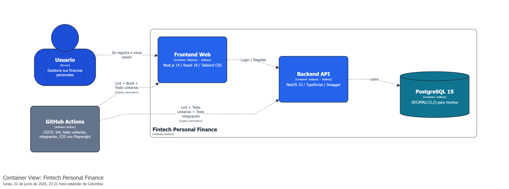

# Fintech - Sistema de Gestión Financiera Personal

MVP de gestión de movimientos financieros personales para una fintech colombiana, desarrollado con **NestJS** (Backend) y **Next.js** (Frontend).

## Tabla de Contenidos

- [Stack Tecnológico](#stack-tecnológico)
- [Requisitos Previos](#requisitos-previos)
- [Instalación y Ejecución](#instalación-y-ejecución)
- [Credenciales por Defecto](#credenciales-por-defecto)
- [Estructura del Proyecto](#estructura-del-proyecto)
- [API Endpoints](#api-endpoints)
- [Testing](#testing)
- [CI/CD](#cicd)
- [Seguridad](#seguridad)
- [Justificación del Stack](#justificación-del-stack)
- [AI Usage](#ai-usage)

---

## Stack Tecnológico

### Backend
| Tecnología | Versión | Propósito |
|---|---|---|
| Node.js | >= 22.x | Runtime de JavaScript |
| NestJS | 10.3.x | Framework backend con arquitectura modular |
| TypeScript | 5.3.x | Tipado estático |
| TypeORM | 0.3.x | ORM con soporte para migraciones |
| PostgreSQL | 15 (Alpine) | Base de datos relacional ACID-compliant |
| Passport + JWT | 10.x | Autenticación y autorización |
| Bcrypt | 5.x | Hash de contraseñas |
| Helmet | 7.x | Headers de seguridad HTTP |
| Swagger | 7.x | Documentación automática de API |
| Jest | 29.7.x | Testing unitario e integración |

### Frontend
| Tecnología | Versión | Propósito |
|---|---|---|
| Next.js | 14.0.x | Framework React con App Router |
| React | 18.2.x | Librería de UI |
| TypeScript | 5.x | Tipado estático |
| Tailwind CSS | 3.x | Estilos utility-first |
| Axios | 1.x | Cliente HTTP con interceptors |
| Vitest | 1.1.x | Testing unitario |
| Playwright | 1.61.x | Testing E2E |

### Infraestructura
| Tecnología | Versión | Propósito |
|---|---|---|
| Docker | 24+ | Contenedorización |
| Docker Compose | 2.x | Orquestación de servicios |
| GitHub Actions | - | CI/CD pipeline |

---

## Requisitos Previos

- **Docker** y **Docker Compose** (para ejecución completa)
- **Node.js** >= 22.0.0 y **npm** >= 10.0.0 (para desarrollo local)

---

## Instalación y Ejecución

### Script de inicio — Un solo comando levanta todo

```bash
git clone <repository-url>
cd fintech-personal-finance
docker compose up --build
```

Este único comando levanta la base de datos, el backend y el frontend automáticamente:
1. **PostgreSQL** (puerto 5432) — se inicia primero con health checks
2. **Backend NestJS** (puerto 3001) — espera a que la DB esté lista antes de arrancar
3. **Frontend Next.js** (puerto 3000) — espera a que el backend esté disponible

No se necesita instalar dependencias, configurar variables de entorno ni ejecutar migraciones manualmente. Todo está orquestado en `docker-compose.yml`.

**Accesos locales:**
- Frontend: http://localhost:3000
- Backend API: http://localhost:3001/api
- Swagger docs: http://localhost:3001/api/docs

### Despliegue en producción (Railway)

La aplicación está desplegada y accesible públicamente:

- **Frontend (aplicación web)**: https://hopeful-prosperity-production-c8bd.up.railway.app/
- **Backend API (documentación Swagger)**: https://fintech-personal-finance-production.up.railway.app/api/docs

El frontend se conecta al backend mediante la API REST. Swagger permite probar todos los endpoints directamente desde el navegador.

### Desarrollo local (sin Docker para backend/frontend)

```bash
# Instalar dependencias
npm install
cd backend && npm install && cd ..
cd frontend && npm install && cd ..

# Copiar variables de entorno
cp .env.example backend/.env

# Levantar todo (DB en Docker + backend + frontend)
npm run start:dev
```

---

## Credenciales por Defecto

### Base de datos (Docker)
| Variable | Valor |
|---|---|
| POSTGRES_USER | `fintech_user` |
| POSTGRES_PASSWORD | `fintech_password_2026` |
| POSTGRES_DB | `fintech_db` |

### Aplicación
| Variable | Valor |
|---|---|
| JWT_SECRET | Configurar en `.env` (mínimo 32 caracteres) |
| JWT_EXPIRATION | `1h` |

> Las credenciales de Docker son valores por defecto para desarrollo. En producción, usar variables de entorno propias (ver `.env.example`).

---

## Estructura del Proyecto

```
fintech-personal-finance/
├── backend/                      # NestJS Backend
│   ├── src/
│   │   ├── modules/
│   │   │   ├── auth/             # JWT, registro, login, guards
│   │   │   ├── transactions/     # CRUD, filtros, balance
│   │   │   ├── categories/       # CRUD, categorías por defecto
│   │   │   └── budgets/          # CRUD, alertas 80%/100%
│   │   ├── database/             # Configuración TypeORM
│   │   └── main.ts
│   └── test/
│       ├── unitarias/            # Tests unitarios (Jest)
│       └── integracion/          # Tests de integración (Jest + DB)
│
├── frontend/                     # Next.js Frontend
│   ├── src/
│   │   ├── app/                  # Pages (App Router)
│   │   ├── components/           # PageHeader, FormModal, LoadingSpinner, Toast
│   │   ├── services/             # Llamadas API (axios)
│   │   ├── hooks/                # useAuth
│   │   ├── lib/                  # axios config, format utilities
│   │   └── types/                # Interfaces TypeScript
│   └── test/
│       ├── unitarias/            # Tests unitarios (Vitest)
│       └── e2e/                  # Tests E2E (Playwright)
│
├── database/
│   └── init.sql                  # Schema inicial PostgreSQL
├── docker-compose.yml            # Orquestación de servicios
├── .github/workflows/ci.yml      # Pipeline CI/CD
└── package.json                  # Scripts de orquestación raíz
```

---

## API Endpoints

### Autenticación
| Método | Ruta | Descripción |
|---|---|---|
| POST | `/api/auth/register` | Registro de usuario |
| POST | `/api/auth/login` | Login (retorna JWT) |

### Transacciones (requiere JWT)
| Método | Ruta | Descripción |
|---|---|---|
| GET | `/api/transactions` | Listar con filtros y paginación |
| POST | `/api/transactions` | Crear transacción |
| GET | `/api/transactions/:id` | Obtener una |
| PATCH | `/api/transactions/:id` | Actualizar |
| DELETE | `/api/transactions/:id` | Eliminar |
| GET | `/api/transactions/balance` | Balance (Ingresos - Egresos) |

### Categorías (requiere JWT)
| Método | Ruta | Descripción |
|---|---|---|
| GET | `/api/categories` | Listar categorías del usuario |
| POST | `/api/categories` | Crear categoría |
| PATCH | `/api/categories/:id` | Actualizar |
| DELETE | `/api/categories/:id` | Eliminar |

### Presupuestos (requiere JWT)
| Método | Ruta | Descripción |
|---|---|---|
| GET | `/api/budgets?month=6&year=2026` | Listar con alertas |
| POST | `/api/budgets` | Crear presupuesto |
| PATCH | `/api/budgets/:id` | Actualizar monto |
| DELETE | `/api/budgets/:id` | Eliminar |

Documentación interactiva en **Swagger**: http://localhost:3001/api/docs

---

## Testing

### Backend

```bash
cd backend

# Tests unitarios
npx jest --config test/jest-unitarias.json

# Tests de integración (requiere DB)
npx jest --config test/jest-integracion.json

# Todos los tests con coverage
npm run test:cov
```

### Frontend

```bash
cd frontend

# Tests unitarios (Vitest)
npx vitest run

# Tests E2E (requiere backend + frontend corriendo)
npx playwright test
```

### Cobertura de tests

| Tipo | Cantidad | Framework |
|---|---|---|
| Backend unitarios | 55 tests | Jest |
| Backend integración | 59 tests | Jest + PostgreSQL |
| Frontend unitarios | 25 tests | Vitest |
| Frontend E2E | 29 tests | Playwright |
| **Total** | **168 tests** | |

---

## CI/CD

Pipeline de GitHub Actions con 4 jobs paralelos:

1. **Backend - Lint & Unit Tests**: ESLint + tests unitarios con coverage
2. **Backend - Integration Tests**: Tests con PostgreSQL real (service container)
3. **Frontend - Lint, Build & Unit Tests**: ESLint + build Next.js + Vitest
4. **Docker - Build, Verify & E2E**: Construye imágenes, verifica health y corre Playwright E2E

Se ejecuta en cada `push` y `pull_request` a `main` y `develop`.

---

## Seguridad

1. **Autenticación**: JWT con expiración de 1 hora, contraseñas con bcrypt (salt rounds = 10)
2. **Aislamiento de datos**: Todas las queries filtran por `userId` del token JWT. Un usuario no puede acceder a datos de otro.
3. **Prevención de ataques**: Helmet (headers HTTP), CORS (solo frontend), rate limiting (100 req/15min), prepared statements (TypeORM contra SQL injection)
4. **Precisión financiera**: PostgreSQL `DECIMAL(15,2)` para montos, sin errores de punto flotante

---

## Justificación del Stack

### ¿Por qué NestJS y Next.js juntos?
Se eligió esta combinación porque ambos frameworks comparten el mismo lenguaje (TypeScript) y filosofía de desarrollo. Esto permite que un desarrollador trabaje en backend y frontend sin cambiar de contexto ni de herramientas. Además, ambos tienen ecosistemas maduros con gran comunidad, lo que facilita encontrar soluciones y librerías compatibles.

### NestJS como backend (en vez de Express puro)
Express es minimalista y requiere que el desarrollador configure manualmente la estructura, validación, documentación y testing. Para un proyecto con 4 módulos (auth, transacciones, categorías, presupuestos), esto genera código inconsistente y difícil de mantener. NestJS resuelve esto con una arquitectura modular donde cada módulo tiene su controlador, servicio y DTOs con validación automática. También incluye Swagger integrado, lo que genera la documentación de la API sin esfuerzo adicional.

### Next.js como frontend (en vez de React + Vite)
React con Vite requiere configurar manualmente el routing, la estructura de carpetas y las optimizaciones de rendimiento. Next.js incluye todo esto de serie: el App Router organiza las páginas por carpetas, el Server Side Rendering mejora la carga inicial, y el sistema de optimización de fuentes e imágenes funciona sin configuración. Para un MVP que podría necesitar una landing pública en el futuro, Next.js ya está preparado para SEO.

### PostgreSQL como base de datos (en vez de MongoDB)
En una aplicación financiera, los datos deben ser consistentes siempre. PostgreSQL garantiza transacciones ACID: si una operación falla a mitad de camino, se revierte todo. Además, el tipo `DECIMAL(15,2)` almacena montos de dinero con precisión exacta, evitando los errores de redondeo que ocurren con números decimales en JavaScript o en bases de datos que usan punto flotante. MongoDB no ofrece estas garantías por defecto, y usarlo para datos financieros es un anti-patrón reconocido en la industria.

### Alertas calculadas en el backend (no en el frontend)
La lógica de alertas de presupuesto (80% y 100%) se calcula en el servidor, no en el navegador. Si se calculara en el frontend, cada cliente (web, mobile, API externa) tendría que implementar la misma lógica por separado, con el riesgo de que los resultados sean diferentes. Al centralizarlo en el backend, hay una única fuente de verdad: todos los clientes reciben las mismas alertas con los mismos datos.

### Diagrama de arquitectura



---

## AI Usage

### Herramientas utilizadas
- **Claude Code (Claude Sonnet 4.6)**: Asistente principal utilizado durante todo el proceso de desarrollo del proyecto.

### ¿En qué se usó la IA?
La IA se utilizó como herramienta de apoyo en **todas las etapas del desarrollo** para aumentar la velocidad de implementación: diseño de la arquitectura, generación de código backend y frontend, creación de tests, configuración de Docker y CI/CD, y refactoring para buenas prácticas. En cada caso, el código generado fue revisado, probado y ajustado según las necesidades del proyecto.

### Proceso de diseño: antes y después de la IA

El diseño del modelo relacional se realizó en dos iteraciones:

1. **Primera iteración (sin IA)**: Se diseñó el modelo relacional manualmente a partir de los requerimientos, definiendo las tablas `users`, `transactions`, `categories` y `budgets` con sus relaciones básicas. Este primer diseño sirvió como base para entender el dominio del problema.


2. **Segunda iteración (con IA)**: Durante la implementación con Claude Code, el modelo se refinó: se agregaron constraints (`UNIQUE` en presupuestos por usuario/categoría/mes/año), se ajustaron los tipos de datos (`DECIMAL(15,2)` para montos financieros), se definieron las políticas de cascade delete y se agregó `SET NULL` en la relación de transacciones con categorías para no perder datos si se elimina una categoría.


### Ejemplo 1: Implementación de alertas de presupuesto
**Prompt**: "La API debe retornar una alerta cuando el gasto acumulado de la categoría supere el 80% y el 100% de su presupuesto."

**Resultado**: La IA generó el servicio `BudgetsService` con métodos `calculateSpentForBudget()` (query agregada sobre transacciones del mes) y `generateAlerts()` (evaluación de porcentaje contra umbrales). El código generado fue correcto y pasó los tests de integración sin modificaciones.

### Ejemplo 2: Debugging de tests E2E
**Prompt**: "Los tests E2E fallan con 16 de 18 errores."

**Resultado**: La IA identificó que `testEmail` se definía una sola vez a nivel de `describe` pero `beforeEach` intentaba registrar el mismo email en cada test, causando conflictos 409. También identificó race conditions entre `router.push()` y el renderizado del toast. Los fixes fueron iterativos — tomó varias rondas de ejecución y análisis de screenshots para resolver todos los casos.

### Ejemplo rechazado/modificado
**Sugerencia de la IA**: Usar `router.push('/dashboard')` de Next.js para la navegación post-login desde un `setTimeout`.

**Problema**: `router.push()` no navegaba de forma confiable después de un hard reload con `window.location.href`. El comportamiento era intermitente — funcionaba en algunos tests y fallaba en otros bajo carga paralela.

**Decisión tomada**: Reemplazar `router.push()` con `window.location.href` para navegación post-login/logout (garantiza navegación), y cambiar los botones del dashboard de `<button onClick={router.push}>` a `<Link href>` de Next.js (navegan sin depender de React hydration). La IA misma propuso este fix después de analizar los screenshots de Playwright que mostraban la página de login en vez del dashboard.

### Valoración del impacto de la IA
La IA aceleró significativamente el desarrollo del MVP (estimado 3-4x más rápido que sin ella), especialmente en scaffolding de módulos NestJS, generación de DTOs con validadores, y configuración de Docker/CI. Sin embargo, los tests E2E requirieron múltiples iteraciones de debugging manual — la IA proponía fixes que resolvían un problema pero introducían otros (como el caso de `router.push`). La revisión humana fue indispensable para decisiones de seguridad (expiración JWT, aislamiento de datos) y para validar que el código cumplía los requerimientos del negocio fintech.
